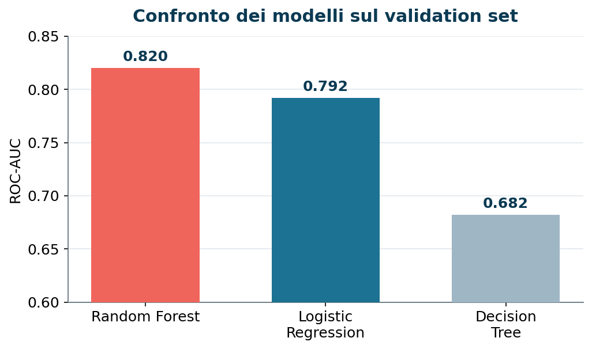
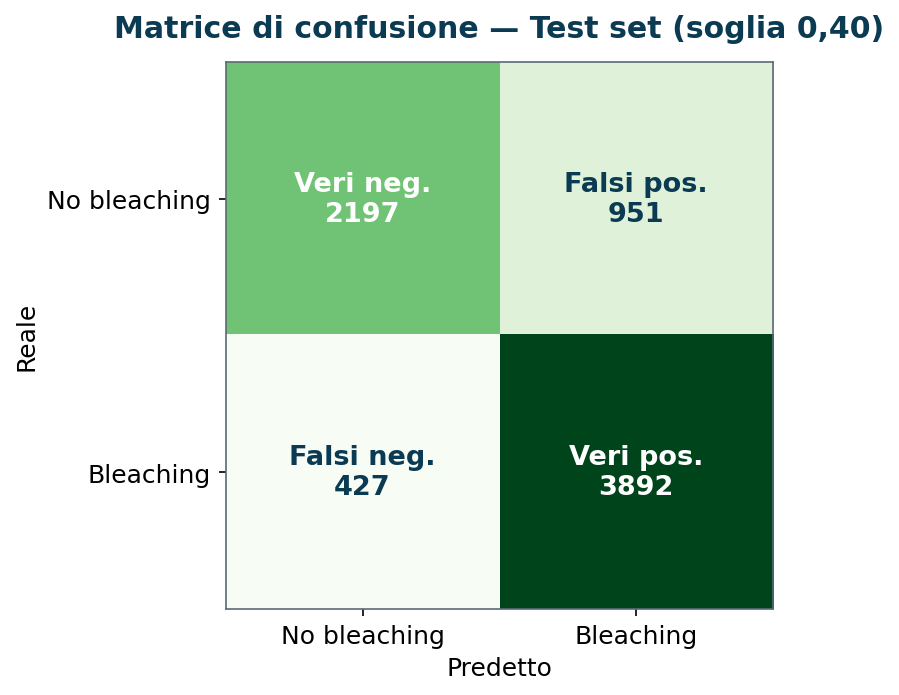
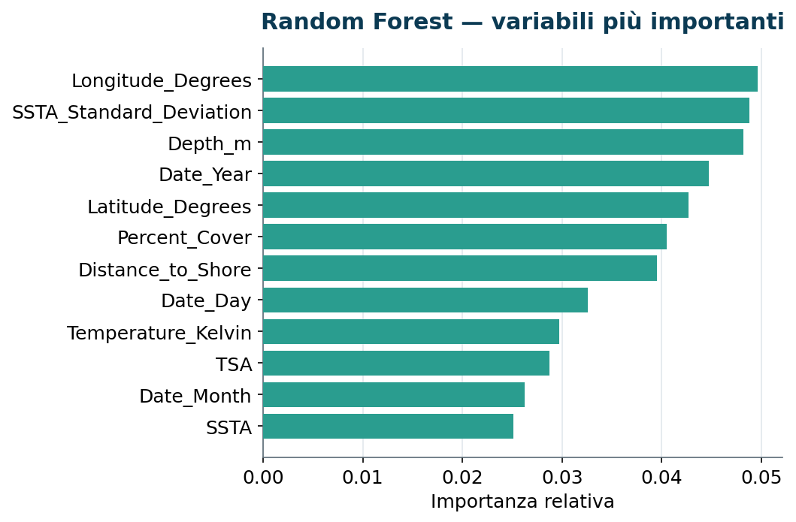
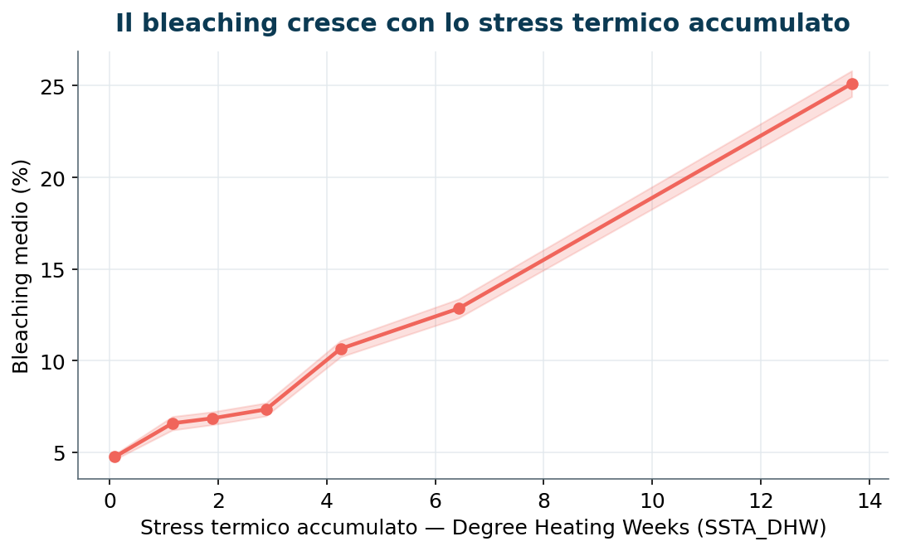

# Coral Bleaching Prediction with Machine Learning

Predizione della presenza di sbiancamento dei coralli (*coral bleaching*) a partire da
variabili ambientali, climatiche, temporali e geografiche, tramite modelli di
classificazione supervisionata.

**Autore:** Giovanna Chessa Orrù

---

## Panoramica

Lo sbiancamento dei coralli è una risposta allo stress — principalmente termico — che
minaccia gli ecosistemi corallini a scala globale. Questo progetto costruisce un modello
in grado di prevedere la presenza/assenza di bleaching (`Bleaching_Occurrence`) su
osservazioni di reef in tutto il mondo, con particolare attenzione a evitare il *leakage*
spaziale e a stimare in modo onesto la capacità di generalizzazione su aree geografiche
mai viste in addestramento.

## Dataset

- **Fonte:** Global Coral Bleaching Database (GCBD) — [Kaggle](https://www.kaggle.com/datasets/mehrdat/coral-reef-global-bleaching)
- **File:** `coral.csv`
- **Dimensioni originali:** 41.361 righe x 62 colonne
- **Dopo la pulizia** (rimozione duplicati e osservazioni senza etichetta): **34.468 osservazioni**
- **Target:** `Bleaching_Occurrence`, binario, pari a 1 se `Percent_Bleaching > 0`
- **Bilanciamento:** circa 50,8% positivi / 49,2% negativi (classi bilanciate)

## Obiettivo

Sviluppare e valutare un modello di Machine Learning che preveda la presenza di bleaching,
privilegiando la **Recall** (individuare gli eventi reali di sbiancamento) coerentemente
con un contesto di monitoraggio ambientale in cui mancare un evento è più costoso di un
falso allarme.

## Metodologia

Il flusso è progettato per evitare il *data snooping* e il *leakage spaziale*:

1. **Data cleaning strutturale** — conversione dei tipi (il marcatore testuale `"nd"` diventa
   `NaN`), rimozione dei duplicati (56 righe, 0,14%) e costruzione del target binario.
2. **Definizione dell'unità di split** — le osservazioni si ripetono nello stesso punto
   geografico; le coordinate vengono arrotondate a 0,1 gradi per formare **cluster geografici**
   (`site_cluster`). Il 97,8% delle osservazioni ricade in cluster con più di una riga.
3. **Split per gruppi** — `GroupShuffleSplit` sui cluster: **train 60% / validation 20% /
   test 20%**, senza alcun cluster condiviso tra gli insiemi.
4. **EDA sul solo training set** — distribuzioni, skewness/kurtosis, outlier, controlli di
   qualità e correlazioni, senza mai osservare validation o test.
5. **Preprocessing in pipeline** — imputazione (mediana), `PowerTransformer` (Yeo-Johnson)
   per i modelli sensibili alla scala, one-hot encoding; tutti i trasformatori stimati
   solo sul training per non introdurre leakage. `Ecoregion_Name` ridotta alle 40 categorie
   più frequenti (94,7% di copertura). Rimossa `Data_Source` perché riflette il protocollo
   di campionamento, non una condizione ambientale reale.
6. **Confronto modelli** — Logistic Regression, Decision Tree, Random Forest.
7. **Scelta della soglia decisionale** — sul validation, per massimizzare la Recall.
8. **Ottimizzazione** — `GridSearchCV` con `GroupKFold` sui cluster geografici (test escluso).
9. **Valutazione finale** — un'unica volta, sul test set geografico mai osservato.

## Risultati principali

Tra i tre modelli confrontati sul validation set, la Random Forest ottiene la ROC-AUC più
alta e il miglior compromesso complessivo tra le metriche.



Il modello finale (Random Forest ottimizzata, soglia decisionale 0,40) viene valutato una
sola volta sul test set geografico, rimasto escluso da confronto e tuning.

| Metrica | Valore (test set) |
|---|---|
| ROC-AUC | **0,911** |
| Recall | 0,901 |
| Precision | 0,804 |
| F1-score | 0,850 |
| Accuracy | 0,815 |

La matrice di confusione mostra che il modello riconosce la gran parte degli eventi reali
di bleaching, mantenendo contenuto il numero di falsi negativi — l'obiettivo prioritario
in un contesto di monitoraggio.



Nessuna variabile domina da sola: il modello combina fattori geografici (longitudine,
latitudine, distanza dalla costa), temporali (anno) e di stress termico, coerentemente con
la natura multifattoriale del fenomeno.



## Cosa emerge dai dati (EDA)

Lo stress termico accumulato (`SSTA_DHW`) è la variabile ambientale più associata al
bleaching: il bleaching medio cresce in modo netto e progressivo all'aumentare dello stress,
passando da circa il 5% nelle osservazioni con stress prossimo allo zero a oltre il 25% ai
valori più elevati. Il risultato è coerente con le conoscenze biologiche sullo sbiancamento.



## Struttura del repository

```
.
├── CoralBleaching_Prediction.ipynb   # Notebook principale (analisi end-to-end)
├── coral.csv                         # Dataset (GCBD)
├── requirements.txt                  # Dipendenze Python
├── images/                           # Grafici usati in questo README
│   ├── model_comparison.png
│   ├── confusion_matrix_test.png
│   ├── feature_importance.png
│   └── bleaching_vs_thermal_stress.png
└── README.md
```

## Requisiti ed esecuzione

Requisiti: Python 3.10+ con le librerie elencate in `requirements.txt`
(`pandas`, `numpy`, `matplotlib`, `seaborn`, `scikit-learn`).

```bash
pip install -r requirements.txt
jupyter notebook CoralBleaching_Prediction.ipynb
```

Il notebook si aspetta il file `coral.csv` **nella stessa cartella** del notebook
(viene caricato con `PATH = 'coral.csv'`). La riproducibilità è garantita da
`random_state=42` in tutti gli split e i modelli.

## Limiti e sviluppi futuri

- **Cluster geografici via arrotondamento** delle coordinate: soluzione semplice e
  trasparente ma approssimata. Alternative: DBSCAN o soglie espresse in chilometri.
- **Nessuna stratificazione simultanea** rispetto a target, fonte e oceano: gli insiemi
  hanno composizioni diverse. Possibile miglioramento: `StratifiedGroupKFold`.
- **Un solo test set geografico**: una stima più robusta richiederebbe più split
  indipendenti o una *nested cross-validation*.
- **Soglia decisionale (0,40)** selezionata sul modello di base e riutilizzata su quello
  ottimizzato: andrebbe ridefinita su predizioni *out-of-fold*.
- **Formulazione binaria**: non distingue eventi lievi, moderati o severi. Sviluppi
  possibili: classificazione multiclasse o regressione sulla percentuale di bleaching.

---

*Progetto realizzato a scopo didattico sul Global Coral Bleaching Database.*
